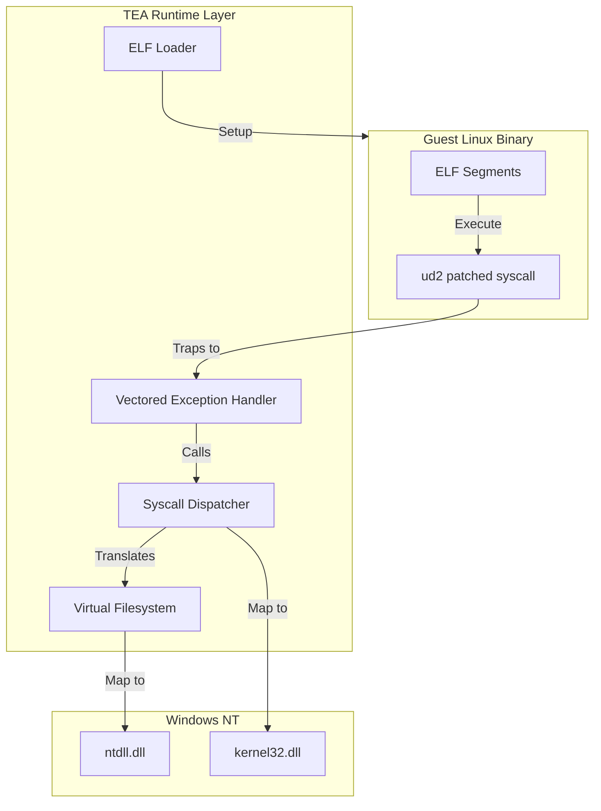

# TEA: Tea Executes Applications

TEA is a lightweight compatibility layer written in Zig that enables running x86_64 Linux ELF binaries natively on Windows. It provides a user-mode environment that emulates the Linux kernel interface, allowing binaries to execute without virtualization or a full Linux distribution.

## 🏗️ Architecture

TEA operates by intercepting Linux system calls and translating them into equivalent Windows NT operations.

### Syscall Redirection (VEH)
To intercept system calls efficiently in user-space, TEA employs a **Vectored Exception Handling (VEH)** strategy:
1.  **Binary Patching**: At load time, the ELF loader scans the guest binary for `syscall` (`0x0F 0x05`) and `int 0x80` (`0xCD 0x80`) instructions.
2.  **Instruction Replacement**: These instructions are replaced with the `ud2` (`0x0F 0x0B`) undefined instruction.
3.  **Exception Trapping**: When the guest executes `ud2`, a hardware exception is raised. TEA's VEH catches this exception, identifies it as a patched syscall, and dispatches the request to the appropriate handler.
4.  **Context Restoration**: After the handler completes, the VEH adjusts the guest's instruction pointer (`RIP`) and restores registers (including critical thread-local storage bases).

### Custom ELF Loader
The loader is responsible for preparing the guest environment:
-   **Segment Mapping**: Parses ELF program headers and maps `PT_LOAD` segments into the process address space using `VirtualAlloc`.
-   **Stack Initialization**: Sets up the initial guest stack according to the System V AMD64 ABI, including `argc`, `argv`, `envp`, and the **Auxiliary Vector (AuxV)**.
-   **vDSO Integration**: Provides a minimal vDSO image to the guest, enabling optimized entry points for time-related syscalls.



## 🚀 Current Features (v1)

The current version (v1) focuses on core stability for statically linked binaries:
-   **Static ELF Execution**: Full support for loading and executing static x86_64 ELF binaries.
-   **ABI Compliance**: Proper initialization of the guest stack with all expected metadata (`AuxV`, `envp`, etc.).
-   **Stable Syscall Core**: Emulation of essential syscalls for process lifecycle, memory management (`mmap`, `brk`), and basic I/O.
-   **Critical Bug Fixes**:
    -   **TLS Support (`FS_BASE`)**: Resolved issues where Thread-Local Storage was lost during syscall transitions by ensuring `FS_BASE` persistence via `wrfsbase`.
    -   **Path Normalization**: Implemented normalization of `argv[0]` and other paths (converting `\` to `/`) to ensure compatibility with tools like BusyBox.

## 🎯 Scope

### v1 (Current Stable Core)
-   Static binary execution.
-   Basic terminal I/O and filesystem access.
-   Memory management and process exit.

### v2 (Roadmap / Out-of-Scope)
The following features are targeted for future versions and are not currently supported in v1:
-   **Dynamic Linking**: Support for `PT_INTERP` and `ld-linux.so`.
-   **Signal Handling**: Complete Linux signal semantics and asynchronous delivery.
-   **Complex Threading**: Full `clone()` implementation and advanced pthread synchronization.
-   **Full POSIX FS**: Advanced filesystem mapping and complex Unix-domain socket support.

## 🛠️ Build & Usage

### Prerequisites
-   [Zig](https://ziglang.org/download/) (latest stable version).

### Build Instructions
```bash
zig build
```
The resulting executable will be located at `zig-out/bin/tea.exe`.

### Usage
To run a Linux binary:
```bash
./zig-out/bin/tea.exe path/to/linux_binary [args...]
```

Example:
```bash
./zig-out/bin/tea.exe ./hello
```
